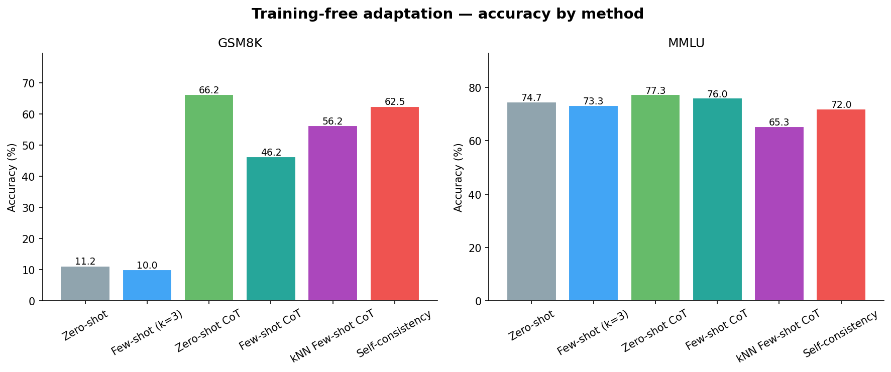
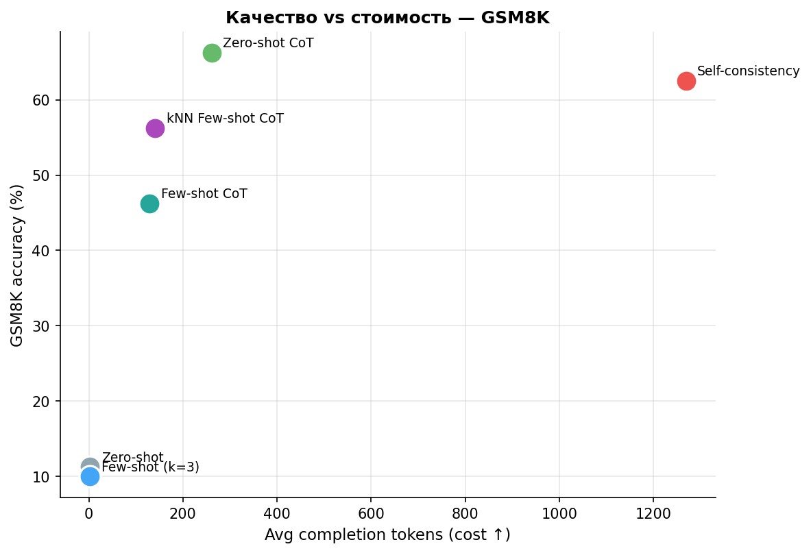

# Training-free адаптация LLM: насколько далеко можно выжать замороженную модель

> **Сравнение методов адаптации без дообучения (zero-shot, few-shot, CoT, self-consistency, kNN-демонстрации) на задачах рассуждения и знаний. Модель — Qwen2.5-1.5B-Instruct.**

[](https://www.python.org/)
[](LICENSE)
[](notebooks/prompt_adaptation_colab.ipynb)

## Обзор

Модель **не дообучается ни на одном этапе** — только инференс. Вопрос: сколько качества можно получить от замороженной `Qwen2.5-1.5B-Instruct` одним лишь промптингом? Сравниваются шесть training-free методов на двух типах задач — **рассуждение** (GSM8K) и **знания** (подмножество MMLU), — чтобы увидеть, где каждый метод работает, а где нет.

**Исследуемые методы:**
| Метод | Идея |
|-------|------|
| Zero-shot | Прямой ответ, без примеров |
| Few-shot (k=3) | k демонстраций в контексте (случайные) |
| Zero-shot CoT | «Давай рассуждать пошагово» — без примеров |
| Few-shot CoT | k демонстраций с цепочками рассуждений |
| kNN Few-shot CoT | Демонстрации выбираются по близости эмбеддингов к вопросу |
| Self-consistency | CoT сэмплируется N раз, ответ — по большинству голосов |

---

## Результаты

> Реальный прогон на GPU T4: GSM8K (80 задач) и MMLU (5 категорий × 15). Воспроизводится через ноутбук.

| Метод | GSM8K (рассужд.) | MMLU (знания) | Ср. токенов (GSM8K) |
|-------|:---:|:---:|:---:|
| Zero-shot | 11.2 | 74.7 | 2 |
| Few-shot (k=3) | 10.0 | 73.3 | 2 |
| **Zero-shot CoT** | **66.2** | **77.3** | 261 |
| Few-shot CoT | 46.2 | 76.0 | 129 |
| kNN Few-shot CoT | 56.2 | 65.3 | 141 |
| Self-consistency | 62.5 | 72.0 | 1269 |

> **Ключевые выводы (часть оказалась неожиданной):**
> - **Chain-of-thought преображает рассуждение, но почти не трогает знания.** На GSM8K «давай рассуждать пошагово» поднимает точность с 11 % до 66 % — в ~6 раз, без единого шага обучения. На MMLU, где нужен факт, а не вывод, прирост всего +2,7 п.п. Метод адаптации надо подбирать под тип задачи.
> - **Простой zero-shot CoT обыграл все «навороченные» методы.** На GSM8K он (66,2 %) выше few-shot CoT (46,2 %), kNN (56,2 %) и даже self-consistency (62,5 %). На модели 1.5B добавление примеров и ретривала не помогло, а порой мешало.
> - **Self-consistency не окупился.** 5 прогонов на вопрос (~1269 токенов против 261) дали *меньше*, чем один zero-shot CoT. Лучшее качество на токен — у обычного CoT.
> - **kNN-выбор примеров навредил**, особенно на знаниях (65,3 % против 74,7 % у zero-shot) — похоже, близкие по форме примеры сбивали маленькую модель.

### Графики

| Точность по методам | Качество vs стоимость |
|:---:|:---:|
|  |  |

---

## Результаты vs. ожидания

- **Ожидалось и подтвердилось:** chain-of-thought даёт кратный прирост именно на рассуждении — это устойчивый, многократно описанный эффект.
- **Оказалось неожиданным:** на модели 1.5B более сложные и дорогие методы (few-shot CoT, kNN, self-consistency) *не* обогнали простой zero-shot CoT. Это согласуется с тем, что такие приёмы scale-dependent — они «включаются» на больших моделях (7B+), а на маленькой ещё не дают выигрыша.
- **Вывод:** для небольшой модели сначала стоит брать самый простой приём рассуждения; усложнение не бесплатно и здесь не окупилось.

---

## Структура репозитория

```
.
├── src/
│   ├── model.py         # обёртка замороженной модели (chat-шаблон)
│   ├── tasks.py         # загрузка GSM8K / MMLU + извлечение ответов
│   ├── prompts.py       # шаблоны промптов под каждый метод
│   ├── methods.py       # zero/few-shot, CoT, self-consistency, kNN
│   ├── retriever.py     # kNN-ретривер демонстраций (эмбеддинги)
│   ├── evaluate.py      # прогон метода → точность + стоимость в токенах
│   └── plot_results.py  # графики + markdown-таблица
├── notebooks/
│   └── prompt_adaptation_colab.ipynb
├── results/
│   ├── results.json
│   └── figures/
├── report/              # научный отчёт + резюме (RU/EN)
├── run_all.py           # весь пайплайн целиком
└── requirements.txt
```

---

## Быстрый старт

### Google Colab (рекомендуется)

Нажми бейдж **Open In Colab**. Зависимости ставятся автоматически, всё работает на бесплатном T4 (~1 час).

### Локально

```bash
pip install -r requirements.txt

python run_all.py                          # полный прогон
python run_all.py --n-test 80 --n-mmlu 15  # свой размер выборки
python run_all.py --quick                  # быстрый смоук-тест
```

---

## Параметры эксперимента

| Параметр | Значение |
|----------|----------|
| Модель | Qwen/Qwen2.5-1.5B-Instruct (заморожена) |
| Задачи | GSM8K (80 задач) · MMLU (5 категорий × 15) |
| Few-shot k | 3 |
| Self-consistency | 5 сэмплов, T=0.7, голосование большинством |
| Эмбеддер для kNN | all-MiniLM-L6-v2 |
| GPU | NVIDIA T4 (бесплатный Colab) |

---

## Что я бы сделал дальше

1. **Ось масштаба** — повторить на 0.5B / 3B / 7B и найти, при каком размере few-shot и self-consistency наконец обгоняют простой CoT (гипотеза о scale-dependence).
2. **Полные датасеты + несколько сидов** — подтвердить порядок методов вне статистического шума (сейчас выборка 80/75).
3. **Почему примеры мешают на малой модели** — менять формат, число и порядок демонстраций.
4. **Контраст задач** — добавить чисто фактологическую (TriviaQA) и чисто логическую (BBH), чтобы резче развести «рассуждение vs знания».
5. **Стоимость честно** — добавить латентность и денежную стоимость (токены × цена).

---

## Лицензия

MIT
