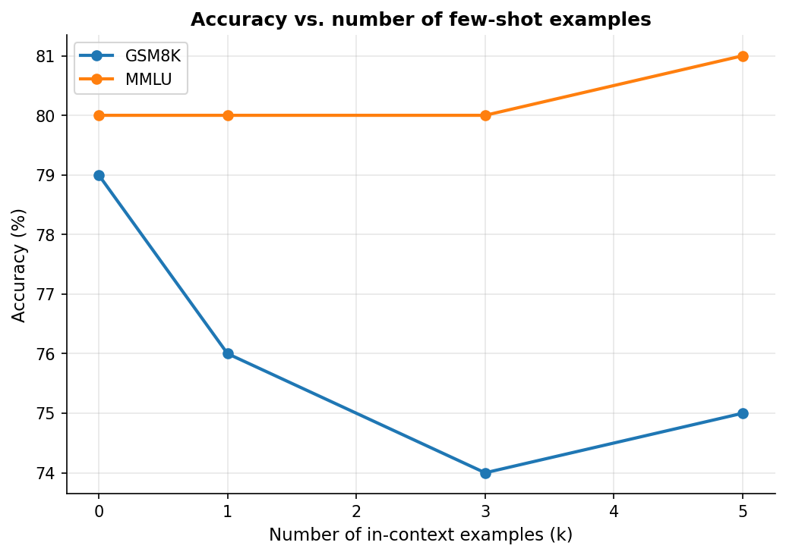

# Training-free адаптация LLM: насколько далеко можно выжать замороженную модель

> **Сравнение методов адаптации без дообучения (zero-shot, few-shot, CoT, self-consistency, kNN-демонстрации) на задачах рассуждения и знаний. Модель — Qwen2.5-3B-Instruct.**

[](https://www.python.org/)
[](LICENSE)
[](notebooks/prompt_adaptation_colab.ipynb)

## Обзор

Модель **не дообучается ни на одном этапе** — только инференс. Вопрос: сколько качества можно получить от замороженной `Qwen2.5-3B-Instruct` одним лишь промптингом? Сравниваются шесть training-free методов на двух типах задач — **рассуждение** (GSM8K) и **знания** (подмножество MMLU), — чтобы увидеть, где каждый метод работает, а где нет.

**Исследуемые методы:**
| Метод | Идея |
|-------|------|
| Zero-shot | Прямой ответ, без примеров |
| Few-shot (k=3) | k демонстраций в контексте (случайные) |
| Zero-shot CoT | «Давай рассуждать пошагово» — без примеров |
| Few-shot CoT | k демонстраций с цепочками рассуждений |
| kNN Few-shot CoT | Демонстрации выбираются по близости эмбеддингов к вопросу |
| Self-consistency | CoT сэмплируется N раз, ответ — по большинству голосов |

> ⚠️ **Числа ниже — иллюстративные заглушки** до реального прогона. Запусти ноутбук в Colab, и `results/results.json` перезапишется реальными данными.

---

## Результаты (заглушки до прогона)

| Метод | GSM8K (рассужд.) | MMLU (знания) | Ср. токенов (GSM8K) |
|-------|:---:|:---:|:---:|
| Zero-shot | 18.0 | 80.0 | 3 |
| Few-shot (k=3) | 20.0 | 80.0 | 3 |
| Zero-shot CoT | 79.0 | 82.0 | 250 |
| Few-shot CoT | 74.0 | 81.0 | 160 |
| kNN Few-shot CoT | 75.0 | 78.0 | 155 |
| Self-consistency | 83.0 | 83.0 | 1200 |

> **Вопросы, на которые отвечает эксперимент:**
> - Насколько chain-of-thought помогает рассуждению против знаний (ожидается кратный разрыв на GSM8K и слабый эффект на MMLU).
> - Окупается ли self-consistency своей ~5× стоимостью в токенах.
> - Помогает ли выбор примеров по эмбеддингам (kNN) против случайных демонстраций.

### Графики

| Точность по методам | Качество vs стоимость | Кривая k-shot |
|:---:|:---:|:---:|
|  |  |  |

---

## Структура репозитория

```
.
├── src/
│   ├── model.py         # обёртка замороженной модели (chat-шаблон)
│   ├── tasks.py         # загрузка GSM8K / MMLU + извлечение ответов
│   ├── prompts.py       # шаблоны промптов под каждый метод
│   ├── methods.py       # zero/few-shot, CoT, self-consistency, kNN
│   ├── retriever.py     # kNN-ретривер демонстраций (эмбеддинги)
│   ├── evaluate.py      # прогон метода → точность + стоимость в токенах
│   └── plot_results.py  # графики + markdown-таблица
├── notebooks/
│   └── prompt_adaptation_colab.ipynb
├── results/
│   ├── results.json
│   ├── kshot.json
│   └── figures/
├── report/              # научный отчёт + резюме (RU/EN)
├── run_all.py           # весь пайплайн целиком
└── requirements.txt
```

---

## Быстрый старт

### Google Colab (рекомендуется)

Нажми бейдж **Open In Colab**. Зависимости ставятся автоматически, всё работает на бесплатном T4.

### Локально

```bash
pip install -r requirements.txt

python run_all.py                          # полный прогон
python run_all.py --n-test 80 --n-mmlu 15  # свой размер выборки
python run_all.py --quick                  # быстрый смоук-тест
```

---

## Параметры эксперимента

| Параметр | Значение |
|----------|----------|
| Модель | Qwen/Qwen2.5-3B-Instruct (заморожена) |
| Задачи | GSM8K · MMLU (5 категорий) |
| Few-shot k | 3 (по умолчанию) |
| Self-consistency | 5 сэмплов, T=0.7, голосование большинством |
| Эмбеддер для kNN | all-MiniLM-L6-v2 |
| GPU | NVIDIA T4 (бесплатный Colab) |

---

## Что я бы сделал дальше

1. **Полные датасеты + несколько сидов** — подтвердить порядок методов вне статистического шума.
2. **Контраст задач** — добавить чисто фактологическую (TriviaQA) и чисто логическую (BBH) задачи, чтобы резче развести «рассуждение vs знания».
3. **Лучшие стратегии выбора примеров** — сравнить kNN с разнообразящими методами (MMR, кластеризация) и порядком примеров.
4. **Автоматический подбор промптов** — APE / промпт-оптимизация вместо ручных шаблонов.
5. **Стоимость честно** — добавить латентность и денежную стоимость (токены × цена).

---

## Лицензия

MIT
